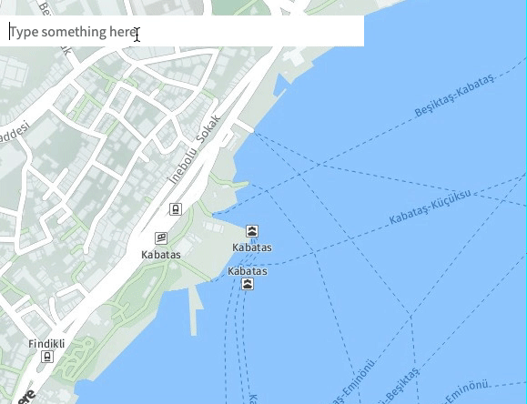

<p align="center">

</p>

<p align="center">
Debounce text input for super fast react.
</p>

## Installation

Install through `npm`:

    npm install react-debounce-text
    
or `yarn`

    yarn add react-debounce-text
    
## Usage

``` JS
import React, { Component } from 'react';
import DebounceText from 'react-debounce-text';

class App extends Component {
  fetch(query, success) {
    let url = `https://api.github.com/search/repositories?q=${query}&language=javascript`;
    fetch(url)
      .then(response => {
        return response.json();
      })
      .then(results => {
        if (results.items != undefined) {
          let items = results.items.map((res, i) => {
            return { id: i, value: res.full_name };
          });

          success(items);
        }
      });
  }

  renderItem(item) {
    return <div>{item.value}</div>;
  }

  onSelect(item) {
    console.log(item);
  }

  render() {
    return (
      <DebounceText
        fetch={this.fetch.bind(this)}
        renderItem={this.renderItem.bind(this)}
        onSelect={this.onSelect.bind(this)}
      />
    );
  }
}

```

## Styles

By default, the package **has no style**.

Consider importing the stylesheet `(scss)` it comes with:

```SCSS
@import "../../node_modules/react-debounce-text/styles/style"
```

## Props

| Prop       | Type                     | Description                                      |
|------------|--------------------------|--------------------------------------------------|
| fetch      | function(query, success) | It run when text input is onChange.              |
| renderItem | function(item, index)    | It renders the results single.                   |
| onSelect   | function(item, index)    | When you click on the found result, it will run. |
